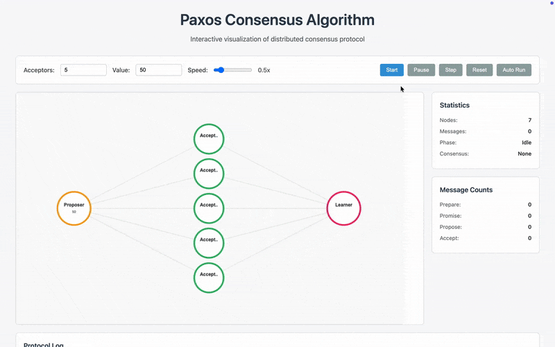

## overview




this project is a go implementation of the paxos consensus algorithm with a simple web interface that shows it running in real time. i built it because reading about paxos on paper wasn’t enough, i wanted to actually see it in action.  

the system lets you:  
- run the classic two-phase paxos protocol (prepare/promise → propose/accept)  
- watch messages move between nodes in a live visualization  
- change the number of acceptors (3, 5, 7, ...) and see how that affects consensus  
- step through the algorithm with a detailed event log  

## why this approach?  

when i first started learning paxos, i ran into a few common problems:  

- the theory felt too abstract, i couldn’t picture how messages flowed  
- sequence numbers were confusing until i watched them increment live  
- majority voting looked simple at first but was harder to reason about in practice  
- failure scenarios were almost impossible to understand without simulating them  

so instead of just reading, i decided to build a small visualization. i kept the web side minimal (plain html, canvas, and vanilla js) so the focus stays on the algorithm.  

### visualization approach  

i went with plain html, canvas, and javascript because i wanted to keep things simple and transparent:  

- back to basics: no frameworks, no build tools, just the web in its simplest form  
- real-time feedback: watch consensus form step by step as messages flow  
- message flow clarity: animated lines make it clear who is talking to who  
- state visibility: every node shows its current state while the protocol runs  
- interactive testing: you can change values or the number of acceptors and see what happens  

## how it works  

### core algorithm  

the implementation follows the classic two-phase paxos protocol:  

**phase 1: prepare**  
- the proposer sends `prepare(n)` to the acceptors  
- acceptors reply with `promise(n)` if `n` is the highest number they have seen  
- the proposer waits for a majority of promises before moving on  

**phase 2: propose**  
- the proposer sends `accept(n, value)` to the acceptors  
- acceptors accept if they have not promised a higher number already  
- the learner confirms consensus once a majority of acceptors agree  

### network simulation  

the nodes are simulated with go’s concurrency tools:  

- goroutines for each participant (proposer, acceptors, learner)  
- channels for message passing between them  
- select statements for handling multiple events without blocking  
- timeouts to prevent any single round from getting stuck  

## setup  

### install  
```bash
git clone git@github.com:0xDVC/go-paxos.git
cd go-paxos
go mod tidy
```

## project layout

```
go-paxos/
├── paxos/
│   └── paxos.go          # core algorithm implementation
├── server/
│   └── server.go         # http server + state management
├── web/
│   ├── index.html        # ui structure
│   ├── styles.css        # visual styling
│   └── paxos.js         # animation + state sync (vanilla js)
├── main.go               # entry point
└── go.mod               # dependencies
```

## technical details

### message types
```go
type MsgType int
const (
    MsgPrepare MsgType = iota + 1  // phase 1
    MsgPromise                      // phase 1 response
    MsgPropose                      // phase 2
    MsgAccept                       // phase 2 response
)
```

### node roles
- **proposer (id 100)** - initiates consensus, manages phases
- **acceptors (ids 1,2,3...)** - respond to prepare/propose
- **learner (id 200)** - detects when consensus is reached

### sequence numbers
- **unique proposal numbers** - combines sequence + proposer id
- **bit shifting magic** - `seq<<4 | id` for global uniqueness
- **monotonic increasing** - ensures higher numbers win

## performance characteristics

### timing
- **prepare phase** - typically 200-400ms per round
- **propose phase** - usually 200ms to completion
- **total consensus** - typically 1-2 seconds with 3 acceptors

### scalability
- **acceptor count** - tested up to 7, should work higher
- **message volume** - scales linearly with acceptor count
- **consensus time** - increases with more acceptors

## known limitations

### current implementation
- **single proposer** - no multi-proposer scenarios
- **no failures** - all nodes are reliable
- **fixed timeouts** - hardcoded delays for visualization
- **simple network** - simulated with channels

### visualization quirks
- **polling based** - websockets would be better
- **animation timing** - sometimes gets out of sync
- **canvas sizing** - fixed dimensions, not responsive

## future ideas

### algorithm improvements
- **multi-paxos** - handle multiple consensus rounds
- **failure simulation** - drop messages, crash nodes
- **leader election** - dynamic proposer selection
- **optimizations** - reduce message count

### ui enhancements
- **websocket updates** - real-time without polling
- **better animations** - smoother message flow
- **mobile support** - responsive design
- **export results** - save consensus data
- **keep it vanilla** - no frameworks, just pure html/css/js

## what i learned

### paxos insights
- **sequence numbers are key**. they prevent conflicts
- **majority logic is elegant**. i found it simple but powerful
- **two phases are necessary** - can't skip either one
- **timeouts matter** - prevent infinite waiting


## results viewing

creates interactive web interface showing:

- **real-time consensus building** - watch agreement form
- **message flow visualization** - see who talks to whom
- **phase transitions** - prepare → propose → consensus
- **node state updates** - current status of each participant


---

*built as a weekend project to understand distributed consensus. now i actually get how this stuff works instead of just reading about it.*
